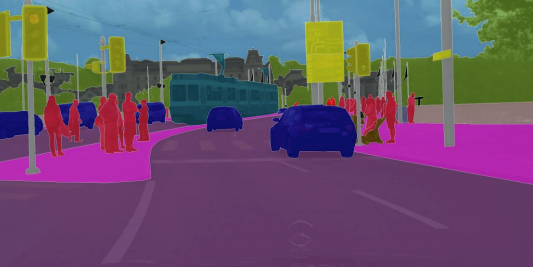
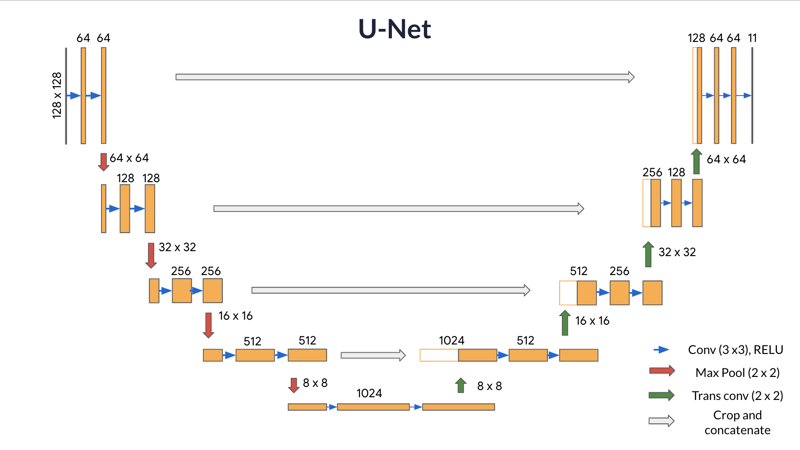
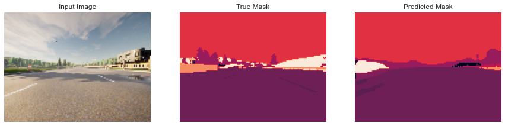
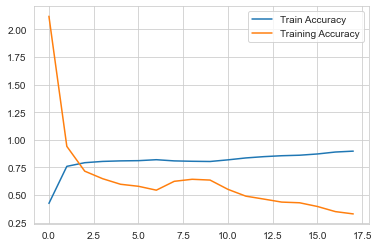

# CityScape Image Segmentation with U-Net

As a part of my Coursera CNN Course, I have built a U-Net, a type of CNN used for image segmentation, i.e to predict a label for every single pixel in an image - in this case, an image from a self-driving car dataset.

The word “semantic” here refers to what's being shown, so for example the “Tree” class is indicated below by the dark pink mask, and "Sky" is indicated with a orange mask:

## U-Net 

U-Net, named for its U-shape, was originally created in 2015 for tumor detection, but in the years since has become a very popular choice for other semantic segmentation tasks. 

<caption>
 U-Net Architecture 
</caption> 
 

**Contracting path** (Encoder containing downsampling steps):
Images are first fed through several convolutional layers which reduce height and width, while growing the number of channels.

**Crop function**: This step crops the image from the contracting path and concatenates it to the current image on the expanding path to create a skip connection. 

**Expanding path** (Decoder containing upsampling steps):
The expanding path performs the opposite operation of the contracting path, growing the image back to its original size, while shrinking the channels gradually.
Next is a concatenation with the correspondingly cropped feature map from the contracting path

**Final Feature Mapping Block**: In the final layer, a 1x1 convolution is used to map each 64-component feature vector to the desired number of classes. 

The U-Net network has 23 convolutional layers in total. 

## Output
Below you can see the visualization of segmentation done by custom U-net model after training for 18 epochs.

    
## Metrics
I have trained the model for 18 epochs and achieved Training Accuracy of about 90% and Training Loss of 0.32. These are pretty good metrics taking in consideration that I have built a custom U-net model.

#### References
Convolutional Neural Networks Course by Deeplearning.ai: https://www.coursera.org/learn/convolutional-neural-networks/
